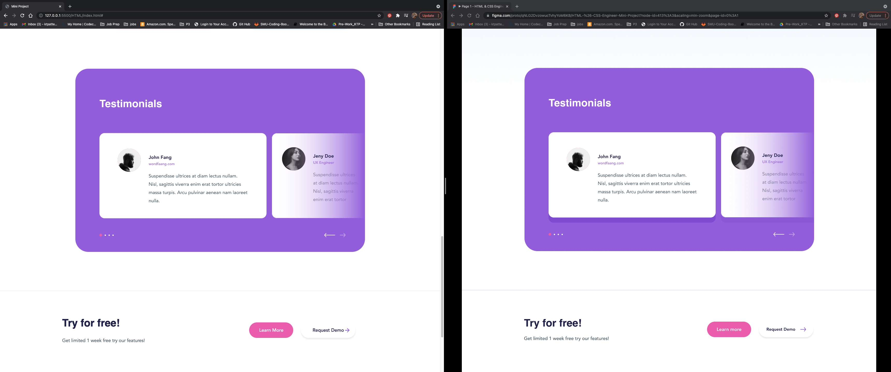

Click Up - Mini Project

I was tasked by Brian Shen to turn a Figma design into responsive html/css.

We were to only use pure html/css. No Bootstrap or other exterior frameworks.

Below is a comparison between the Figma rendered design (right), and what I was able to create (left).

:
:
:
:
: